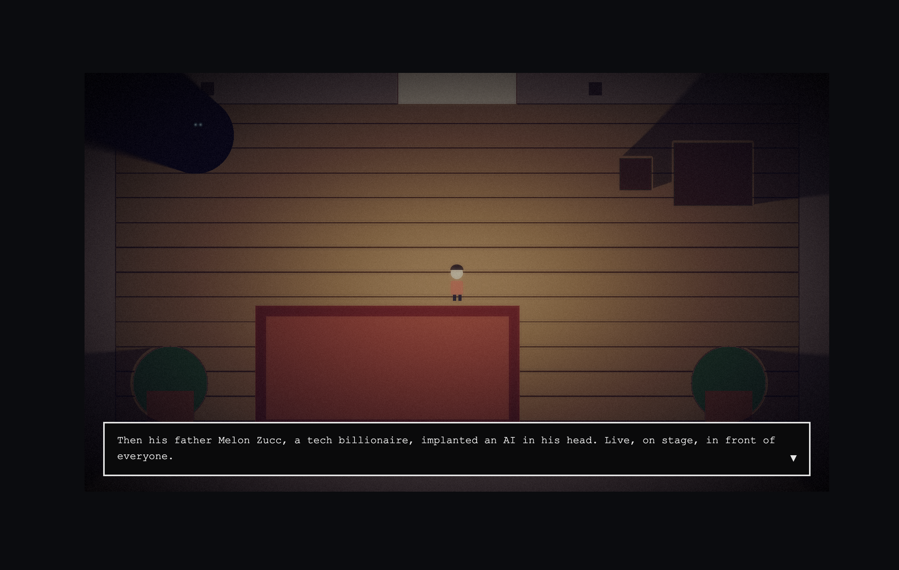
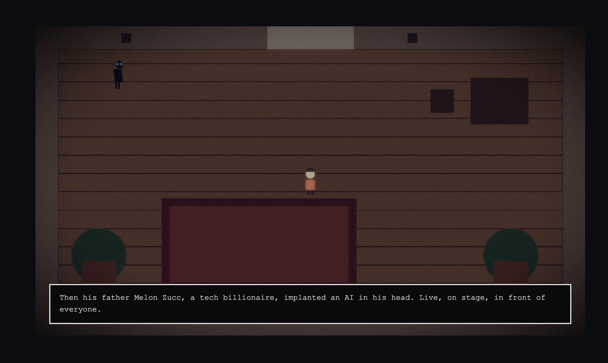

# Let Me Ask Charlie: DH2323 Project Report

Author: Ashmit Deb Roy (KTH)  
Project: *Let Me Ask Charlie*  
Course: DH2323

## Abstract
*Let Me Ask Charlie* is a browser-based interactive vignette built around a custom real-time lighting and shadow pipeline rather than an off-the-shelf game engine renderer. The environment's surface normals are derived procedurally in a GLSL fragment shader from a greyscale height map using a Sobel gradient. No pre-authored normal map exists anywhere in the project. Lambertian (N·L) diffuse shading, an SDF soft-shadow raymarcher extended to a shared scene distance field (covering both the moving antagonist and static furniture), and a four-effect post-processing pass (bloom, Reinhard tone mapping, vignette, hash-based film grain) complete the pipeline. All characters are drawn procedurally with no image or sprite-sheet assets. A short evaluation compares the full lit pipeline against an unlit control build (`?mode=flat`) using the Self-Assessment Manikin, isolating the rendering technique itself as the variable under test rather than evaluating the experience as a whole. Across n = 8 within-subjects sessions, the lit condition scored directionally higher than flat on all three SAM dimensions (valence, arousal, dominance), though only as a suggestive, exploratory signal at this sample size rather than a statistically powered result; open-ended responses suggest the technique changes what participants attend to, not simply how afraid they feel.

## 1. Introduction
*Let Me Ask Charlie* explores an interactive experience where a user can “ask Charlie” and receive responses in a constrained, designed setting (visual + interaction + narrative framing). The project is implemented as a custom application rather than a full-featured game engine project, which foregrounds deliberate technical and design choices in rendering, interaction, and system architecture.


## 2. Background and Related Work
This project sits at the intersection of:

- **Real-time rendering techniques** (lighting/shading, shadows, tone mapping) commonly used in interactive graphics [1], [2], [3], [4].
- **Signed distance field (SDF) rendering / sphere tracing** as a compact procedural geometry + rendering approach [3], [2].
- **Human–computer interaction and cultural framing of conversational systems** (e.g., how people attribute intelligence/agency, and how social context shapes interpretation) [5], [6].
- **Perceptual and visual communication foundations** relevant to composition and how viewers read images [7].

One additional source on procedural game-feel design was consulted early in the project but excluded from this bibliography after its bibliographic record could not be independently verified as a stable, citable publication; its content is not relied on anywhere in this report.

## 3. Technical Contribution (What We Built Beyond “Using a Game Engine”)
This section distinguishes the project from assembling equivalent functionality in Unity/Unreal via built-in renderers and post-processing.

### 3.1 Contributions
- **Custom real-time rendering pipeline choices**: explicit implementation and tuning of shading, shadowing, and tone mapping steps (rather than relying on engine defaults), with design-motivated parameters and constraints [1], [4].
- **Procedural/SDF-based rendering approach**: sphere tracing/ray marching used for both the dynamic antagonist and static scene geometry, enabling soft-shadow approximations within a single shared shadow pass [3], [2].
- **Design-driven visual perception framing**: purposeful control of contrast, luminance mapping, and composition to support readability and mood [4], [7].

### 3.2 Non-goals
- Not a general-purpose engine or editor.
- Not photorealistic global illumination; effects are chosen for clarity, performance, and authorial control.

### 3.3 Implementation-status policy
Any technique described in this report as "implemented" is confirmed working in the running build at time of writing. Techniques that were attempted and abandoned, or that remain partially working, are labeled as such explicitly (see §7).

## 4. Rendering Techniques and How They Are Used
This section covers only techniques actually present in the build, each with a primary-source citation.

### 4.1 Shading (diffuse + normals)
- **Lambertian diffuse** (\(N\cdot L\)) is the baseline diffuse model in real-time shading pipelines [1].
- **Normal mapping** perturbs per-fragment normals to add high-frequency detail without increasing geometric complexity [1].
- **Height-map-derived normals via Sobel gradient**: since the environment has no 3D mesh and no precomputed tangent basis, per-fragment normals are instead derived directly from a greyscale height map using a Sobel operator, a classical image-gradient technique, not a tangent-space normal-mapping method. (An earlier draft cited Schüler's tangent-space normal-mapping technique here; that paper solves a different problem, deriving a TBN basis for a 3D mesh, and was removed as a mismatched citation, see §9.)

### 4.2 Shadows
- **Soft shadows for SDF ray marching** can be approximated by single-ray methods that produce plausible penumbrae in practice [2]. This is the only shadow technique implemented; shadow mapping / percentage-closer filtering was cited in an earlier draft but is not used anywhere in the pipeline (see §9).

### 4.3 SDF Ray Marching / Sphere Tracing
- **Sphere tracing** provides a robust ray–implicit surface intersection method using distance bounds, widely cited as the origin of modern SDF ray marching practice [3].

### 4.4 Tone mapping (HDR → display)
- **Photographic tone reproduction** maps high dynamic range luminance values to a displayable range while preserving perceived contrast; the Reinhard operator is a common baseline [4].

### 4.5 Supplementary: procedural audio (beyond core scope)
Not a primary contribution: the project's technical core remains the rendering pipeline in 4.1–4.4. Added afterward for atmosphere: a spatial drone synthesized directly from raw Web Audio API oscillator, gain, and stereo-panner nodes (no samples, same first-principles approach as the shaders), panned toward Charlie's position and intensified with proximity, plus short synthesized stings for confrontation and a fake-out "vanish" event. This connects to the horror-through-implication design goal already discussed in 8; Grimshaw's audio uncanny valley concept (sound cues that suggest a threat without confirming it) is the closest fit [8].

## 5. System Overview
The application is a static site (p5.js in WEBGL mode, no build step). It has two independent parts sharing one repository: a GitHub Pages blog (`docs/`) and the game itself (`src/`). This section describes the game's architecture as implemented.

### 5.1 Render loop: three shader passes into one framebuffer
Every frame, `renderScene()` runs three GLSL passes in sequence, matching the multi-pass architecture proven early in development (`createFramebuffer()`), since no single shader can compute lighting, shadowing, and post-processing simultaneously: each pass needs the previous pass's completed output as an input texture, which is only possible once that output exists off-screen.

```
Pass 1 (sobel.vert/frag):  height map → Sobel gradient → normal
                           → N·L diffuse × material albedo → framebuffer
Pass 2 (shadow.vert/frag): raymarch scene SDF (Charlie + static furniture)
                           → soft shadow factor, MULTIPLY-blended onto framebuffer
[procedural sprites drawn directly, resetShader()]
Pass 3 (post.vert/frag):   framebuffer texture → bloom → Reinhard tone map
                           → color grade → vignette → film grain → screen
```

The height map doubles as both a normal-derivation source (via its local gradient, sampled with a Sobel kernel) and a material/albedo map (via its raw per-pixel value, decoded into discrete color bands in `materialColor()`): one texture serving two distinct roles in the same shader.

Pass 2 does **not** raymarch a single merged scene SDF, despite an earlier plan (and an earlier draft of this section) describing it that way. `charlieSDF()` and `furnitureSDF()` stay as two separate distance functions, and the shared `raymarch()` routine is called twice per pixel, once against each, because furniture needed different treatment than Charlie in two ways the merged version couldn't express: an exclusion test near the furniture's own surface (to avoid self-shadowing, see §7.2) that Charlie doesn't need, and a lighter maximum darkness floor so furniture shadows read as present but not full-black:

```glsl
float shadowCharlie = raymarch(p0, lightPx, false);

float shadowFurniture = 1.0;
if (furnitureSDF(p0) > 3.0) {           // skip the self-shadow zone
  shadowFurniture = raymarch(p0, lightPx, true);
  shadowFurniture = max(shadowFurniture, 0.6);  // furniture shadows stay lighter
}

float shadow = min(shadowCharlie, shadowFurniture);
```

The two independently-marched shadow *factors* are combined with `min()` after raymarching, not the underlying distance fields before it. This is a real architectural divergence from the "one merged SDF, one raymarch" design in §3.1/§4.3 above, worth naming plainly rather than leaving the cleaner-sounding version in the report once the code took a different path for a concrete reason.

### 5.2 Interaction loop
`draw()` runs a small state machine (`start → intro → playing → confront → choice → ending`) gating what `updateGameplay()` is allowed to do each frame. During `'playing'`, keyboard input (WASD/arrows) updates the player's UV-space position, which is then used both as the light source position for Pass 1 and as the pursuit target for Charlie's steering:

```javascript
const dx = playerPos.x - charliePos.x;
const dy = playerPos.y - charliePos.y;
const dist = sqrt(dx * dx + dy * dy);
const rampT = constrain(
  (elapsedSeconds - CHARLIE_SLOW_PHASE_SECONDS) /
  (CHASE_TARGET_SECONDS - CHARLIE_SLOW_PHASE_SECONDS), 0, 1);
let charlieSpeed = lerp(CHARLIE_SPEED_BASE, CHARLIE_SPEED_MAX, rampT);

if (elapsedSeconds >= closingWindowStart) {
  if (rubberbandDistRef === null) rubberbandDistRef = dist;
  if (dist > rubberbandDistRef) charlieSpeed *= RUBBERBAND_BOOST;
}

if (dist > 0.001) {                 // guards a division-by-zero when Charlie is exactly on the player
  charliePos.x += (dx / dist) * charlieSpeed;
  charliePos.y += (dy / dist) * charlieSpeed;
}
```

`charlieSpeed` is built from three stages, tuned after playtesting made the first version (a flat 25-second ramp) feel wrong: for the first `CHARLIE_SLOW_PHASE_SECONDS` (10s), Charlie holds near his base speed, giving the player room to explore the room before any real pressure starts. From there, speed ramps linearly toward a value slightly above player speed by around `CHASE_TARGET_SECONDS` (25s), aiming for a full chase in the 20 to 30 second range rather than the much longer, flatter pacing the first version produced. In the final `RUBBERBAND_WINDOW_SECONDS` (8s) before that target, a rubber-band check snapshots the player's distance from Charlie at the moment that window opens; if the player has since pulled further away (evading well, right as time is running out), Charlie's speed gets a `RUBBERBAND_BOOST` (1.6x) spike on top of the ramp. This is what stops a well-evading player from trivially outrunning him forever, without making the opening seconds feel punishing. Distance also drives two other systems: the shadow raymarcher's radius uniform (closer = larger shadow) and a capped "fake-out" event, where Charlie briefly vanishes from the scene entirely (his position uniform is pushed off-canvas, so both his sprite and his contribution to the shared shadow SDF disappear) before reappearing elsewhere in the room.

### 5.3 Dialogue and state transitions
A small typewriter-effect dialogue engine (`startDialogue()` / `advanceDialogue()`) drives the intro exposition, the confrontation sequence, and the ending, all rendered as a DOM overlay above the canvas rather than as WEBGL text, an explicit choice after an earlier attempt at in-canvas text disturbed the shader pipeline state (`resetShader()` was required and still left artifacts). Reaching the confrontation state presents a binary Y/N choice; per the original spec, both choices converge to the same ending screen, since the narrative branch itself is not the graded contribution. The rendering pipeline is.

### 5.4 Audio
A separate module (`audio.js`) synthesizes all sound with raw Web Audio API oscillator, gain, and stereo-panner nodes (no sample files). A detuned two-oscillator drone is panned toward Charlie's position and increases in intensity with proximity; short synthesized stings mark the confrontation and the fake-out vanish. This mirrors the rendering pipeline's own constraint (nothing pre-authored, everything generated from first principles) but is explicitly a supplementary system, not part of the graded rendering contribution (§4.5).

## 6. Evaluation Plan
Full consent text and rating sheet: `report/user-study-form.md`. Raw per-participant response data: `report/user-study-data/`.

Within-subjects comparison (n ≥ 5, counterbalanced order) between the full lit pipeline and a flat/unlit condition (`?mode=flat`: same scene, characters, audio, and post-processing; only the environment lighting/shadow terms are removed), measured with the Self-Assessment Manikin (valence/arousal/dominance) [9] plus two open questions per condition. This isolates the actual technical contribution (§3–4) as the thing under test, rather than evaluating the game as a whole.

| Lit condition | Flat condition (`?mode=flat`) |
|---|---|
|  |  |

The same moment under both study conditions. Only the N·L diffuse and shadow terms differ; room layout, the antagonist's position, materials, and post-processing are identical, isolating the rendering technique as the variable under test.

### 6.1 Results (n = 8)

Full per-participant data: `report/user-study-data/` (raw Google Form CSV exports). n = 8 (5 lit-first, 3 flat-first), collected through the study's Google Form.

| Dimension | Lit (M ± SD) | Flat (M ± SD) | Paired diff (Lit − Flat) |
|---|---|---|---|
| Valence | 5.63 ± 2.33 | 4.50 ± 2.07 | +1.13 |
| Arousal | 6.13 ± 2.70 | 5.00 ± 3.07 | +1.13 |
| Dominance | 4.38 ± 2.13 | 4.25 ± 2.49 | +0.13 |

The directional pattern across all three dimensions is the same: the lit condition scored higher, not lower, than flat. That's the opposite of the naive prediction that better lighting should read as more unpleasant or more threatening; what it more likely reflects is that the flat condition felt less like a coherent scene and more like an abstract, disorienting one, which several participants described as unsettling in a different way rather than simply "less scary." A Wilcoxon signed-rank test on Valence, the only dimension with no tied or zero paired differences at this n, gives W = 10.5 (n = 8), not significant at α = .05. Arousal and Dominance both had 4 of 8 participants report exactly zero difference between conditions, itself a real finding (roughly half the sample felt no dimensional shift at all), but too few non-zero pairs remain to support a meaningful test on those two; they are reported descriptively only. Consistent with the protocol's own framing, this is exploratory: a directional signal worth reporting, not a powered significance result.

Representative quotes:
- "The unlit version felt more scary because it seemed more cold and unrealistic. Second one also felt less scary because I already knew the scene." This participant played flat first, then lit, and names a genuine confound the design tries to control for but cannot fully remove: familiarity with the room's layout on a second playthrough plausibly reduces tension regardless of which condition comes second.
- "More creepy with no light, you see everything flat, creepier when I see it walking around compared to heavy darkness like a blob." A different participant's read on the same trade-off: the lit condition's shadow rendering obscures Charlie into an ambiguous mass, while flat rendering shows him plainly, and for this participant the plain version was the more unsettling one, a genuine counterpoint to the pipeline's own design thesis.
- "The sound had more of an impact in the second version. When most of the screen is obscured, my mind feels quieter, I abstract on the rest and focus on the danger. The dynamic lighting was also impactful, as it wasn't a predictable, constant switch on-off of the lights. It varied, with the evolving speed, making it weirder, more mysterious." This one does support the design thesis directly: the shadow radius tied to Charlie's approach speed (§5.2) reads to this participant as unpredictable in a way that a fixed on/off light would not.

Taken together, the quotes matter more than the numbers here: they suggest the technique changes what participants attend to (sound vs. sight, ambiguity vs. clarity) rather than uniformly amplifying fear, which the SAM means alone would not have surfaced.

## 7. Discussion

### 7.1 Coordinate space is not a detail: it's load-bearing
The clearest failure mode encountered in this project was computing SDF distances directly in normalized UV space (0–1 on both axes) against a non-square 960×540 canvas. Since a unit of UV-x and a unit of UV-y map to different pixel counts, every distance computed that way is implicitly stretched along whichever axis is shorter in real pixels. This went unnoticed for Charlie's circular SDF (a circle stretched slightly still reads as roughly circular) but was immediately obvious once rectangular furniture SDFs were added: the shadows rendered as large diagonal wedges, not the shape of the objects casting them. The fix (converting all distance math to pixel space by multiplying UV coordinates by `uResolution` before use) is trivial once identified, but the bug is a useful cautionary example: SDF techniques assume an isotropic metric space, and a screen-space canvas is only isotropic if it happens to be square.

### 7.2 Self-shadowing is a structural property of naive SDF raymarching, not an edge case
Any pixel that lies on (or inside) an occluder's own surface is, by definition, at or near zero distance from that occluder's SDF. A raymarch that starts exactly at such a pixel immediately reads "blocked." For Charlie this was invisible, because his 2D silhouette sprite is drawn on top of the shadow pass afterward and physically occludes the artifact. Static furniture has no equivalent sprite layer, so the self-shadowing was fully visible until pixels within a small margin of the furniture's own surface were explicitly excluded from the shadow test. This suggests a general rule for combining raymarched shadows with rasterized geometry: either every occluder needs a covering sprite/mesh, or the raymarch needs an explicit "am I on the caster" exclusion. The two are not equivalent, and mixing techniques without accounting for this produces a subtle, easy-to-miss bug.

### 7.3 Procedural sprites vs. authored art
Every character and every piece of furniture in the final build is drawn with p5 primitives (rectangles, ellipses) rather than image assets. This kept the "no black-box assets" constraint consistent across the whole pipeline (height map, normals, shadows, and now geometry are all generated, not imported) but it is a real trade-off against visual fidelity. A hand-authored sprite would read more clearly as a character at a glance; the procedural approach requires more careful use of silhouette, motion (bob, lean, walk-cycle), and glow to communicate the same information a few strokes of pixel art would convey instantly. Given the professor's explicit framing that story/character design are not graded and the environment pipeline is the actual contribution, this trade-off was made deliberately in favor of keeping every visual element traceable to code rather than to an asset file.

### 7.4 Chase pacing as a design parameter, not just a bug fix
The initial fixed speed differential (player at 0.003, Charlie at 0.0008, roughly 4x slower) made the chase literally unwinnable by evasion, which meant the only way to reach an ending was to walk toward the antagonist on purpose. A flat 25-second ramp fixed the unwinnable case but, once playtested, felt wrong in the other direction: no distinction between "just started" and "about to be caught," and no way for the room's design (the intro's few seconds of stillness, the two plants, the photo frames) to actually be noticed before the pressure started. The current three-stage model (a slow opening, a ramp toward a roughly 20 to 30 second total, and a late rubber-band spike if the player is visibly winning as time runs low) is a direct response to that playtest: it separates "give the player room to look around" from "make sure a good player can't simply outrun the mechanic forever" instead of collapsing both into one linear curve. This is worth noting as a case where a numeric parameter has narrative consequences: getting the pacing right, not just resolvable, is what makes the "the math does the horror automatically" design thesis (stated as early as the second development session) actually true at the level of an entire playthrough, not just a single frame's shadow radius.

### 7.5 Limitations
- **Single dynamic light source.** The point-light model (mouse/player position) is sufficient for the horror mechanic but does not generalize to multi-light scenes without restructuring the N·L pass.
- **No formal significance testing on Arousal/Dominance.** At n=8, the study (§6) is explicitly framed as exploratory; the one dimension with enough non-zero pairs for a Wilcoxon test (Valence) was not significant at this n, and any directional finding is suggestive, not statistically conclusive.
- **Equipment consistency held only partially.** All 8 sessions were moderated (the researcher present throughout), but some were in-person on shared equipment and others were synchronous online with the participant screen-sharing from their own device, screen, and speakers. The original protocol's equipment-consistency control (§ Design) applies fully to the in-person subset only.
- **Bloom is a single-pass 9-tap approximation**, not a multi-radius Gaussian bloom, sufficient for this project's scale but not a general-purpose technique.
- **Shadow softness (`k` in the Quilez estimator) is currently a fixed constant per occluder type** (sharp for Charlie, floored/soft for furniture) rather than a fully continuous material property.

## 8. Ethical and Societal Reflection
Conversational AI systems can be misread by users as having genuine understanding or intent; framing and disclosure matter in how such systems are presented [5], [6]. The project's central mechanic (an antagonist that is simultaneously an AI assistant and a rendering artifact with no fixed visual form) deliberately engages this ambiguity rather than resolving it. Separately, visual design decisions (colour grade, contrast, vignette) are not neutral: they actively shape a viewer's interpretation and emotional response to a scene [7], which is the premise the evaluation in §6 attempts to test directly rather than assume.

## 9. Citation Corrections (2026-08-27)

A full pass comparing this report and the blog diary against the actual codebase found three references that didn't hold up, all now removed from `report/references.md`:

- **Holopainen, *Foundations of Gameplay* (2011)**: never verified as a real, citable publication, and was never actually cited in-text anywhere in this report. Dead weight; removed.
- **Fernando, Ed., *GPU Gems* (2004)**: was cited in §4.2 for shadow mapping / percentage-closer filtering (PCF). This project doesn't implement shadow mapping anywhere; the only shadow technique is the Quílez SDF raymarch (now [2]). Removed, and the PCF bullet in §4.2 removed with it.
- **Schüler, "Normal Mapping Without Precomputed Tangents" (2013)**: was cited in §4.1 for the Sobel-derived normals. Schüler's actual technique derives a tangent-space (TBN) basis for 3D mesh normal mapping; this project has no mesh and no tangent space, only a screen-space Sobel gradient on a height map. The *technique* (procedural normal derivation) is real and implemented, but the citation for it wasn't the right one. Removed rather than force a citation that doesn't describe what the code does.

All remaining citations ([1]–[9] in the current numbering) were checked individually against the running code and confirmed in use.

